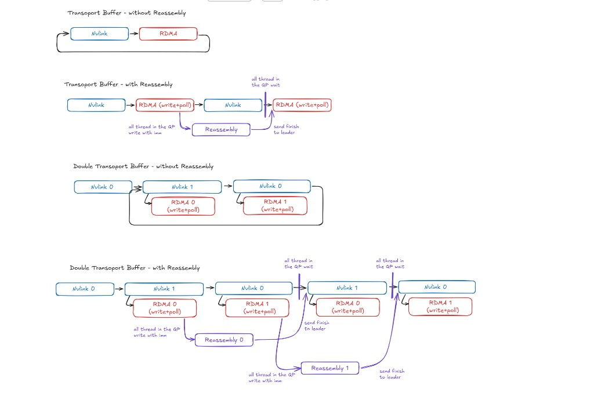

# RDMA Test Pipelines and Synchronization

This document describes the data pipelines for sender and receiver in all test modes, together with synchronization points between threads. It covers both the baseline (non-piped) paths and the transport-buffer piping variants including double-buffer.

---

## Synchronization Primitives

| Primitive | Participants | Purpose |
|-----------|--------------|---------|
| **start_barrier** | Main + all worker threads | All threads ready before timed work begins |
| **end_barrier** | Main + all worker threads | All threads finished; main takes end time |
| **completion_barrier** | Main + all worker threads | Workers signal "iteration work done" |
| **iteration_barrier** | Main + all worker threads | Main releases workers for next iteration (after signal-back in reassembly) |
| **reassembly_barrier** | Main + K receiver QP threads | All receiver threads finished reassembly for this iteration |
| **qp_mutex** | Per QP, shared by threads using that QP | Serialize RDMA operations when multiple threads share a QP |
| **qp_signal_mutex / qp_signal_cond / qp_pipe_ready** | Per QP, sender threads only | Per-pipe signal coordination in piping modes (leader broadcasts, non-leaders wait) |

**When barriers are used:** `needs_barriers = !is_server || (allow-nvlink && reassembly)`

---

## Mode 1: Direct Mode (`--direct`, no all-to-all)

**Threads:** N threads (1 per GPU/NIC pair). Each thread owns one QP.

### Sender Pipeline (per iteration)

```
1. start_barrier
2. For each iteration:
   a. RDMA write (from QP buffer, full size)
   b. RDMA poll
   c. completion_barrier
   d. iteration_barrier
3. end_barrier
```

### Receiver Pipeline

**Passive.** Receiver threads run `write_thread` which immediately `sleep(300)`. Data arrives via RDMA one-sided write into pre-posted receive buffers. No active pipeline.

### Synchronization

| Point | Sender | Receiver |
|-------|--------|----------|
| start_barrier | Main + N workers | — |
| completion_barrier | Main + N workers | — |
| iteration_barrier | Main + N workers | — |
| end_barrier | Main + N workers | — |
| qp_mutex | No (1 thread per QP) | No |

---

## Mode 2: Direct All-to-All (`--direct --all-to-all`)

**Threads:** N×K threads (N sources × K targets). Each thread owns one QP. Data: slice of source buffer (no copy; external buffer registration).

### Sender Pipeline (per iteration)

```
1. start_barrier
2. For each iteration:
   a. RDMA write (slice from source buffer, part_size)
   b. RDMA poll
   c. completion_barrier
   d. iteration_barrier
3. end_barrier
```

### Receiver Pipeline

**Passive.** Same as Mode 1.

### Synchronization

Same as Mode 1. No qp_mutex (1 thread per QP).

---

## Mode 3: NICs-Only (`--nics-only`)

**Threads:** K threads (1 per NIC). All threads use GPU 0's buffer; each reads a different slice.

### Sender Pipeline (per iteration)

```
1. start_barrier
2. For each iteration:
   a. RDMA write (slice from shared buffer, part_size = buffer_size/num_qps)
   b. RDMA poll
   c. completion_barrier
   d. iteration_barrier
3. end_barrier
```

### Receiver Pipeline

**Passive.** Same as Mode 1.

### Synchronization

Same as Mode 1. No qp_mutex.

---

## Mode 4: Allow-NVLink, No Reassembly (`--allow-nvlink --source-gpus ...`)

**Threads:** N×K threads (N sources × K QPs). Single-source: N=1, so K threads. Multi-source: N>1, so N threads share each QP.

**Pipeline is the same** for single- and multi-source. When N>1, multiple threads share a QP and must serialize RDMA access via `qp_mutex`.

### Sender Pipeline — Baseline (per iteration)

```
1. start_barrier
2. For each iteration:
   a. NVLink copy (or cudaMemcpy if same GPU): source slice → QP buffer [at offset if multi-source]
   b. NVLink sync
   c. [If N>1: qp_mutex lock]
   d. RDMA write
   e. RDMA poll
   f. [If N>1: qp_mutex unlock]
   g. completion_barrier
   h. iteration_barrier
3. end_barrier
```

### Receiver Pipeline

**Passive.** Data lands in QP buffers via RDMA. No per-pipe signaling.

### With Piping (`--transport-buffer SIZE`)

The full slice is split into `num_pipes` chunks of `section_size` bytes each. The receiver is still passive (no reassembly); each pipe chunk lands at a distinct remote offset.

**Sender pipe loop** (replaces steps a–f above):
```
For each pipe p (0..num_pipes-1):
  a. NVLink copy: source_slice[p * section_size] → QP_buffer at local_offset
  b. NVLink sync
  c. [qp_mutex lock]
  d. RDMA write to remote_off = source_gpu_idx * pipe_slice_size + p * section_size
  e. RDMA poll
  f. [qp_mutex unlock]
```

No per-pipe barriers or signals; each thread runs independently.

### With Piping + Double Buffer (`--transport-buffer SIZE --double-buffer`)

Sender allocates two transport buffers (buf[0], buf[1]) per source per QP. NVLink fill of buf[next] overlaps with RDMA send of buf[cur].

**Sender pipe loop**:
```
Pre-load chunk 0 into buf[0]; NVLink sync.

For each pipe p:
  cur = p % 2;  nxt = 1 - cur
  if p+1 < num_pipes:
    NVLink copy chunk[p+1] → buf[nxt]   ← async, runs concurrently with RDMA
  [qp_mutex lock]
  RDMA write buf[cur] to remote_off = source_gpu_idx * pipe_slice + p * section_size
  RDMA poll
  [qp_mutex unlock]
  if p+1 < num_pipes:
    NVLink sync                          ← ensure buf[nxt] ready before next flip
```

**Overlap**: T_nvlink(chunk p+1) runs concurrently with T_rdma(chunk p). Per-pipe effective latency ≈ max(T_nvlink, T_rdma).

### Synchronization

| Point | Sender | Receiver |
|-------|--------|----------|
| start_barrier | Main + N×K workers | — |
| completion_barrier | Main + N×K workers (baseline only; skipped when piping active) | — |
| iteration_barrier | Main + N×K workers | — |
| end_barrier | Main + N×K workers | — |
| qp_mutex | Only when N>1 | No |
| qp_signal_* | No (no reassembly) | No |

---

## Mode 5: Allow-NVLink With Reassembly (`--allow-nvlink --reassembly --source-gpus ...`)

**Threads:** Sender N×K, Receiver K (one per QP).

**Signal-back**: After reassembling each pipe, the receiver sends an RDMA write-with-imm back to the sender. The sender must wait for this signal before reusing the transport buffer.

### Sender Pipeline — Baseline (no piping, per iteration)

```
0. (Main, once before loop) Post num_iterations receive WQEs for signal-back on QP 0
1. start_barrier
2. For each iteration:
   a. NVLink copy: source slice → QP buffer
   b. NVLink sync
   c. qp_mutex lock
   d. RDMA write with imm (data + source_gpu_idx in one operation)
   e. RDMA poll
   f. qp_mutex unlock
   g. completion_barrier
   h. iteration_barrier  ← blocks until main receives signal-back
3. end_barrier
```

### Receiver Pipeline — Baseline (per iteration)

```
1. start_barrier
2. For each iteration:
   a. Post N receive WQEs (1-byte each; slot offsets not used in baseline — write-with-imm data lands at RDMA-specified offset)
   b. For each source: poll completion (imm = source_gpu_idx); NVLink copy + sync to reassembly_buffer[source_gpu_idx] (reassembly_copy_and_sync per completion)
   c. reassembly_barrier
   d. completion_barrier
   e. (Main) rdma_write_with_imm signal-back → sender (QP 0)
   f. (Main) rdma_poll_completion
   g. iteration_barrier
3. end_barrier
```

### With Piping (`--transport-buffer SIZE`)

Per-pipe signal-back replaces the per-iteration global barrier. No `completion_barrier` or `reassembly_barrier` per pipe — all coordination is per-QP.

**Overlap:** NVLink for chunk[p+1] runs right after RDMA for pipe p, overlapping with receiver reassembly of pipe p. The signal is polled at the *start* of the next pipe (before RDMA), not after RDMA.

**Sender pipe loop** (leader = source_gpu_index 0; non-leaders wait on cond):
```
Pre-fetch chunk[0] → transport buffer; NVLink sync

For each pipe p:
  if p > 0:
    leader: poll recv CQ for signal-back (receiver finished pipe p-1); increment qp_pipe_ready; broadcast
    non-leader: wait on cond until qp_pipe_ready >= p
  leader: post receive WQE for this pipe's signal-back
  [qp_mutex lock]
  RDMA write_with_imm chunk[p] (imm = source_gpu_idx)  /* chunk[p] already in buffer */
  RDMA poll
  [qp_mutex unlock]
  if p+1 < num_pipes:
    NVLink copy chunk[p+1] → transport buffer   ← overlaps with receiver reassembly of pipe p
    NVLink sync

Drain last pipe's signal (receive was pre-posted at start of last iteration)
```

**Receiver pipe loop**:
```
For each pipe p:
  Post N receives at fixed slot offsets (reused each pipe; reassembly mode uses small QP buf)
  Poll N completions; for each: NVLink async reassembly + sync (reassembly_copy_and_sync)
  rdma_write_with_imm signal-back (0xDEADBEEF)
  rdma_poll_completion (signal send complete)
```

**CQ isolation**: Each QP has separate send_cq and recv_cq. The leader's `rdma_poll_completion_with_imm` (recv_cq, outside qp_mutex) cannot steal completions from other threads' `rdma_poll_completion` (send_cq, inside qp_mutex).

### With Piping + Double Buffer (`--transport-buffer SIZE --double-buffer`)

Sender keeps **2 pipes in flight**. Receiver has two remote transport buffers (remote_buf[0], remote_buf[1]).

**Sender**:
```
Pre-post 2 receive WQEs (for signals from pipes 0 and 1).
Pre-load chunk[0] into buf[0]; NVLink sync.

For each pipe p:
  cur = p % 2;  nxt = 1 - cur
  if p >= 2:
    leader: poll signal confirming remote_buf[cur] is free (i.e., pipe p-2 reassembled)
    leader: post receive WQE for pipe p's signal (always; receiver sends one per pipe including last two)
    leader: increment qp_pipe_ready; broadcast
    non-leader: wait until qp_pipe_ready >= p - 1
  if p+1 < num_pipes:
    NVLink copy chunk[p+1] → buf[nxt]   ← async
  [qp_mutex lock]
  RDMA write_with_imm buf[cur] → remote_buf[cur] at offset cur * transport_buffer_size + ...
  RDMA poll
  [qp_mutex unlock]
  if p+1 < num_pipes:
    NVLink sync

Drain 2 signals after loop (for last min(2, num_pipes) pipes).
```

**Receiver**:
```
Pre-post N receives for remote_buf[0] and N receives for remote_buf[1].

For each pipe p:
  cur = p % 2
  Poll N completions (landing in remote_buf[cur]); NVLink async reassembly for each
  NVLink sync
  rdma_write_with_imm signal-back
  rdma_poll_completion
  if p+2 < num_pipes: re-post N receives for remote_buf[cur] (now free for pipe p+2)
```

**Overlap**: receiver is reassembling pipe p while the sender has already sent pipe p+1 into remote_buf[nxt]. Receiver reassembly latency is hidden behind the next RDMA send.

### Main Thread (both sides)

**Sender main (before loop):** Post num_iterations receive WQEs on each QP (baseline only; piping mode posts inside the loop).

**Receiver main (per iteration, baseline):**
```
reassembly_barrier → completion_barrier → rdma_write_with_imm → rdma_poll → iteration_barrier
```

**Sender main (per iteration, baseline):**
```
completion_barrier → rdma_poll_completion_with_imm → iteration_barrier
```

**Piping mode:** Main participates only at start_barrier, end_barrier, and iteration_barrier (once per timing iteration). Per-pipe signals go directly between QP threads.

### Synchronization

| Point | Sender Workers | Receiver Workers | Sender Main | Receiver Main |
|-------|----------------|------------------|-------------|---------------|
| start_barrier | ✓ | ✓ | ✓ | ✓ |
| reassembly_barrier | — | ✓ (baseline) | — | ✓ (baseline) |
| completion_barrier | ✓ (baseline) | ✓ (baseline) | ✓ (baseline) | ✓ (baseline) |
| iteration_barrier | ✓ | ✓ | ✓ | ✓ |
| end_barrier | ✓ | ✓ | ✓ | ✓ |
| qp_mutex | ✓ (per QP) | No | — | — |
| qp_signal_* | ✓ (piping, N>1) | No | — | — |

---

## Mode 6: All-to-All NVLink Reassembly (`--allow-nvlink --reassembly --all-to-all`)

**Threads:** Sender N×K×M (one per sub-slice), Receiver K (one per QP).
**Parameters:** N = source GPUs, K = transport NICs/QPs, M = logical targets (`--target-count`, default M=K).

### Key Formulas

| Quantity | Formula |
|----------|---------|
| sub_slice_size | 1GB / (M × K) |
| slice_size (per target, per source) | 1GB / M |
| QP buffer size | N × (1GB / K) = N × K × sub_slice_size |
| Sender threads | N × K × M |
| Receiver threads | K |
| Reassembly buffers | N × M buffers, each 1GB/M, on GPUs 0..M-1 |
| Reassembly NVLink ctxs | K × M (index k×M+m) |

Thread (n, k, m): source GPU n, transport QP k, logical target m.
Slot index: `nj = n*M + m`. Slot offset in QP buffer: `nj * sub_slice_size`.

### Sender Pipeline — Baseline (per iteration)

```
1. start_barrier
2. For each iteration:
   a. NVLink copy: source[n][m*(1GB/M) + k*sub_slice] → QP buffer k, slot nj
   b. NVLink sync
   c. qp_mutex lock (QP k)
   d. RDMA write with imm (imm = nj = n*M+m)
   e. RDMA poll
   f. qp_mutex unlock
   g. completion_barrier
   h. iteration_barrier
3. end_barrier
```

### Receiver Pipeline — Baseline (per iteration)

```
1. start_barrier
2. For each iteration:
   a. Post N×M receive WQEs per QP (slot nj at offset nj * section_size)
   b. For each slot nj: poll completion (wr_id = nj); NVLink copy + sync to reassembly_buffers_2d[nj] at k * sub_slice (NVLink async + sync per completion)
   c. reassembly_barrier
   d. completion_barrier
   e. (Main) signal-back (QP 0)
   f. iteration_barrier
3. end_barrier
```

### With Piping (`--transport-buffer SIZE`)

Same as Mode 5 piping. `section_size = transport_buffer_size / (N×M)`.
Leader: `source_gpu_index == 0 && slice_index_j == 0`.

**Remote write offset**: `remote_off = nj * section_size` (QP buffer slot nj, reused each pipe).

**Receiver pipe loop**:
```
For each pipe p:
  Post N×M receives at offsets nj * section_size
  Poll N×M completions; NVLink async reassembly to reassembly_buffers_2d[nj] at pipe * section_size
  NVLink sync
  signal-back (0xDEADBEEF)
  rdma_poll_completion
```

### With Piping + Double Buffer (`--transport-buffer SIZE --double-buffer`)

Generalizes Mode 5 double-buffer to N×M slots per QP.

**Slot buffer offset**: `buf[b] for slot nj = b * transport_buffer_size + nj * section_size`
**Remote offset**: `cur * transport_buffer_size + nj * section_size`
**Leader**: `source_gpu_index == 0 && slice_index_j == 0`

**Receiver**:
```
Pre-post N×M receives for remote_buf[0] and N×M for remote_buf[1].

For each pipe p:
  cur = p % 2
  Poll N×M completions (src from remote_buf[cur])
  NVLink async reassembly for each slot; NVLink sync
  signal-back; rdma_poll_completion
  if p+2 < num_pipes: re-post N×M receives for remote_buf[cur]
```

### Synchronization

Same as Mode 5. qp_mutex: N×M sender threads per QP serialize.

---

## Summary: Modes and Options

| Mode | start | completion | iteration | end | reassembly | qp_mutex | qp_signal_* |
|------|-------|------------|-----------|-----|------------|----------|-------------|
| Direct | Sender | Sender | Sender | Sender | — | No | No |
| Direct all-to-all | Sender | Sender | Sender | Sender | — | No | No |
| NICs-only | Sender | Sender | Sender | Sender | — | No | No |
| NVLink (no reassembly) | Sender | Sender | Sender | Sender | — | N>1 only | No |
| NVLink reassembly | Both | Both (baseline) | Both | Both | Receiver (baseline) | Yes | Piping only |
| All-to-all reassembly | Both | Both (baseline) | Both | Both | Receiver (baseline) | Yes | Piping only |

---

## Piping (`--transport-buffer SIZE`)

### Pipeline Overview (Diagram)

The following diagram illustrates the four transport-buffer pipeline configurations: single vs. double buffer, each with and without reassembly.



| Configuration | Sender flow | Overlap | Code location |
|---------------|-------------|---------|---------------|
| **Single buffer, no reassembly** | NVLink → RDMA → (loop) | None | `test_rdma_multi_qp.c` ~1286–1360 (single-buffer path, `!reassembly`) |
| **Single buffer, with reassembly** | Poll signal → post receive → RDMA → NVLink next | NVLink for chunk[p+1] overlaps with receiver reassembly of chunk[p] | `test_rdma_multi_qp.c` ~1566–1770 |
| **Double buffer, no reassembly** | NVLink[nxt] async → RDMA[cur] → sync | NVLink for buf[nxt] runs concurrently with RDMA for buf[cur] | `test_rdma_multi_qp.c` ~1243–1360 |
| **Double buffer, with reassembly** | Poll signal (p≥2) → NVLink[nxt] async → RDMA[cur] → sync | Same as above; signal gates reuse of remote_buf[cur] | `test_rdma_multi_qp.c` ~1363–1560 |

**Code verification:** The implementation matches the diagram. Single-buffer reassembly uses the overlap design (RDMA first, then NVLink for next chunk). Double-buffer paths overlap NVLink fill with RDMA send. The "send finish to leader" in the diagram corresponds to `rdma_write_with_imm(0xDEADBEEF)` signal-back from receiver to sender.

---

When `transport_buffer_size < slice_size`, the transfer is split into `num_pipes = ceil(slice_size / section_size)` chunks. `section_size = transport_buffer_size / N_per_qp` where:

- Mode 4 (no reassembly): `N_per_qp = N` (number of sources per QP)
- Mode 5 (reassembly): `N_per_qp = N`
- Mode 6 (all-to-all): `N_per_qp = N × M`

**Buffer sizing**:

| Side | No reassembly | Reassembly | Reassembly + double-buffer |
|------|---------------|------------|---------------------------|
| Sender QP buf | `transport_buffer_size` | `transport_buffer_size` | `2 × transport_buffer_size` |
| Receiver QP buf | full slice size (accumulates pipes) | `transport_buffer_size` | `2 × transport_buffer_size` |

**Per-mode behaviour**:
- **No reassembly (Mode 4):** Pipe loop on sender only; receiver is fully passive. Each pipe writes to a distinct remote offset `source_gpu_idx * pipe_slice_size + p * section_size`. No per-pipe sync.
- **Reassembly (Modes 5, 6):** Receiver signals sender per pipe via `rdma_write_with_imm` on each QP (per-QP back-channel). Single-buffer: sender polls signal at start of pipe p (p>0), then RDMA, then NVLink for chunk[p+1] (overlaps with receiver reassembly). Double-buffer: sender waits before pipe p+2 (2 pipes in flight).
- **CQ isolation:** Each QP uses separate send and receive CQs (`send_cq` / `recv_cq`). `rdma_poll_completion` polls `send_cq`; `rdma_poll_completion_with_imm` polls `recv_cq`. Prevents leader's signal poll from stealing send completions from other threads.

---

## Double Buffer (`--double-buffer`)

Requires `--transport-buffer`. Allocates two local staging buffers per source per QP, alternating between them.

**Applies to**: Modes 4, 5, 6 (all NVLink modes with piping active).

**Signal protocol changes vs. single-buffer piping**:

| Aspect | Single-buffer | Double-buffer |
|--------|---------------|---------------|
| Pre-posts before loop | 1 | 2 |
| First pipe requiring signal wait | pipe 1 | pipe 2 |
| In-loop re-posts | num_pipes − 1 | num_pipes − 2 |
| Drain signals after loop | 0 | 2 |
| Remote offset formula | `nj * section_size` | `(p%2) * tb + nj * section_size` |

**`qp_pipe_ready` predicate** (non-leader wait):
- Single-buffer: `qp_pipe_ready >= pipe`
- Double-buffer: `qp_pipe_ready >= pipe - 1`

Reset to 0 after `iteration_barrier` by the leader.
